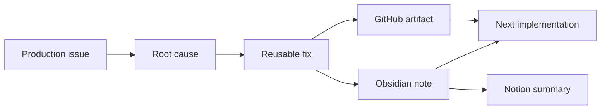

  

  
  
  

 

<table>
<tr>
<td width="58%" valign="top">
  <h2>Operator Profile</h2>
  
I work where <strong>Martech engineering</strong>, <strong>experimentation</strong>, <strong>production debugging</strong>, and <strong>AI-assisted knowledge systems</strong> overlap.

  
My daily work is not just shipping personalization code. It is turning fragile operational knowledge into reusable systems: documented patterns, safer deployments, better debugging loops, and searchable technical memory.

</td>
<td width="42%" valign="top">
  <h2>Current Signal</h2>

<pre><code>Focus        Adobe Target + AEP
Domain       Personalization at scale
Language     JavaScript / TypeScript
Mode         Debug -> Document -> Reuse
AI Layer     Agents + knowledge workflows</code></pre>

</td>
</tr>
</table>

---

## What I Build

<table>
<tr>
<td width="33%" valign="top">
  <h3>Personalization Systems</h3>
  
Adobe Target activities, Recommendations, VEC implementations, preview flows, QA routines, and deployment patterns for complex digital products.

</td>
<td width="33%" valign="top">
  <h3>Production Debugging</h3>
  
SPA behavior, duplicated components, missing carousels, audience mismatch, data layer issues, tracking gaps, feed problems, and edge cases that only appear in real environments.

</td>
<td width="33%" valign="top">
  <h3>AI Knowledge Ops</h3>
  
GitHub as technical source of truth, Obsidian as semantic memory, Notion as human documentation, and agents to collect, classify, summarize, and reuse knowledge.

</td>
</tr>
</table>

---

## Core Stack

  
  
  
  
  

  
  
  
  
  

  
  
  
  
  
  

---

## Operating Model

I care about the full loop: evidence, cause, fix, documentation, and reuse.

---

## Areas I Think About

<table>
<tr>
<td valign="top" width="50%">
  <ul>
    <li>Adobe Target in enterprise environments</li>
    <li>AEP audiences, identity, destinations, and profile attributes</li>
    <li>Recommendations, feeds, criteria, and Velocity templates</li>
    <li>SPA-safe personalization with JavaScript</li>
    <li>Tracking reliability with dataLayer, XDM, and analytics events</li>
  </ul>
</td>
<td valign="top" width="50%">
  <ul>
    <li>Technical knowledge architecture for AI</li>
    <li>Agent workflows for engineering and documentation</li>
    <li>Turning incident history into playbooks</li>
    <li>Human-readable documentation for technical operations</li>
    <li>Automation that improves judgment instead of hiding it</li>
  </ul>
</td>
</tr>
</table>

---

## How I Work

> Debug the real behavior. Document the pattern. Automate the boring part. Keep the judgment explicit.

- I prefer production evidence over generic best practices.
- I write down decisions, not just implementations.
- I treat repeated bugs as missing systems.
- I use AI agents to move faster, but not to blur accountability.
- I care about traceability from source to outcome.

---

## GitHub Snapshot

  
  

  

